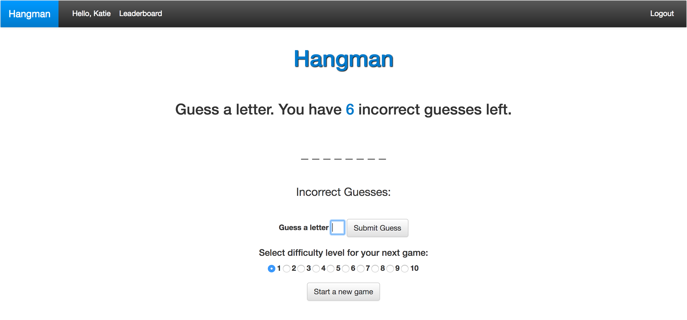

# Hangman

Hangman is a one person word guessing game. A user can set up an account, view their standing in a leaderboard, and adjust the difficulty of the words on a scale from 1-10.

##Prerequisites
1. Install Postgres for the database

 https://www.postgresql.org/

2. This was developed using ruby version 2.3.1 and built on rails 5.0.1

##Install
1. To install the gems, go to the root project directory in your terminal and type

 `bundle install`

2. Create, migrate, and seed the database

 `rails db:setup`

3. Start the server to view in your browser

 `rails s`

4. Open a web browser window and navigate to

  http://localhost:3000/

5. You are now ready to start playing!

##Using the site

1. When first opening the site, you will see the leaderboard with the top ten players. Create a new account using the "Signup" link on the nav bar or click the "Start a new game" button. Both will take a new user to the page to create a new account.

2. Enter a username, email, password, and then confirm the password. If the fields are not properly filled out, a notification stating, "log in was unsuccessful" will appear and you can try again.

3. Once logged in, you will see the leaderboard page. You can select the level of difficulty before playing the game on a scale from 1-10. The default is set to 1 (easiest). Now press "Start a new game".

4. Now you can see the game board with empty spaces representing the length of the word. The cursor to guess a letter is automatically set in the text field. Type a letter and press enter or, "Submit Guess". Only one letter will be allowed per guess. The form is not case sensitive.

5. If the guess was correct, the letter will replace the blank space. If the guess was incorrect the letter will appear under the "Incorrect Guesses" and the number of incorrect guesses left will decrease by one. If 6 incorrect guesses are made, the game will end. If the same letter is guessed twice, it will not count against the player.

6. At any time, a player can begin a new round by pressing the "Start a new game" button.

7. A user can check to see if they have made the top ten by pressing "Leaderboard" in the nav bar.

8. Log out in the upper right-hand corner of the nav bar.

##Tests

1. To run the test suite navigate to the root project directory

2. Type

 `bundle exec rspec`
